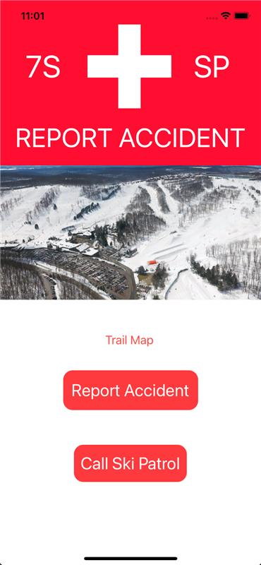
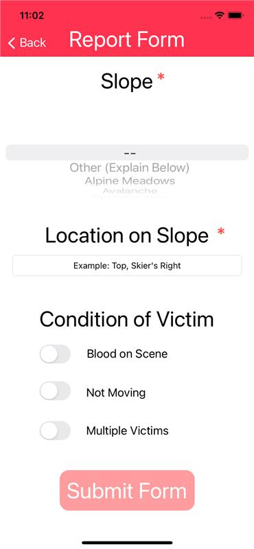
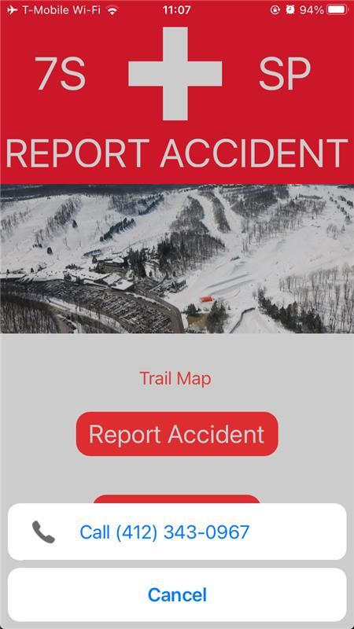

# Seven Spirngs Accident Reporting Application
A mobile device app that skiiers and snowboarders can use at Seven Springs resort to report accidents and injuries. Users can fill out an accident report form or call the emergency ski patrol phone number to recieve the quickest care possible. 
## Intentions
This application intends to help first responders at Seven Springs render aid more quickly and efficiently than the current system.  A user making a report via the app will get useful information to ski patrol more quickly than waiting to get off of the lift or to the bottom of the slope. This can ultimately save lives when serious accidents occur.
## Main Page
When users open the application they will see the options to either make a accident report or call the ski patrol directly.

## Report Form
Users are able to provide information in the report such as the trail, the exact location and details about the condition of the victim.  Once the user submits the report, the application communicates to a server.  This allows the ski partol to instantly access the details of the report.

## Call Page
If the user chooses to call rather that fill out a report, the application will dial the ski patrol with one button.

## Trail Map
If the User needs a visual to find what slope they are on, the trail map button will provide a visual for them.

## History
1. Mad an initial pitch to form a team
2. Started a trello sight to manage scrums
3. Created a wireframe of the app
4. Made a pitch with the intial design
5. Started Xcode project to design the app
6. Added and set up server 
7. Created LICENSE and README

## Goals
* Currently this application is only compatable with IOS.  We wish to create a similar program as a website to accomidate android and other users.
* We plan to pitch this program to the Seven Springs ski patrol with hopes that it could be implemented into their operations.

## Team
>Andrew Toader 
>Tyler Comisky
>Nick Latiolais
>Jason Weger

## [License](https://github.com/aet37/Ski-Patrol-App/blob/main/LICENSE.md)
