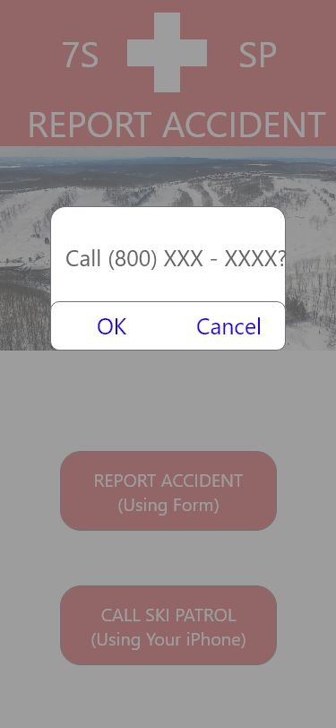

# Seven Spirngs Accident Reporting Application
A mobile device app that skiiers and snowboarders can use at Seven Springs resort to efficiently report accidents and injuries. Users can fill out an accident report form or call the emergency ski patrol phone number to recieve the quickest care possible. 
## Main Page
When users open the application they will see the options to either make a accident report or call the ski patrol directly.

## Report Form
Users are able to provide details in the report such as the trail, the exact location and details about the condition of the victim.

## Form Submitted
Once the user submits the report, the application communicates to a server.  This allows the ski partol to instantly access the details of the report.

## Call Page
If the user chooses to call rather that fill out a report, the application will dial the ski patrol with one button.

## Trail Map

## Demo

## History

## Intentions
This application intends to help first responders at Seven Springs render aid more quickly and efficiently than the current system.  A user making a report via the app will get useful information to ski patrol more quickly than waiting to get off of the lift or to the bottom of the slope. This can ultimately save lives when serious accidents occur.
## Changes

## Team

## License

